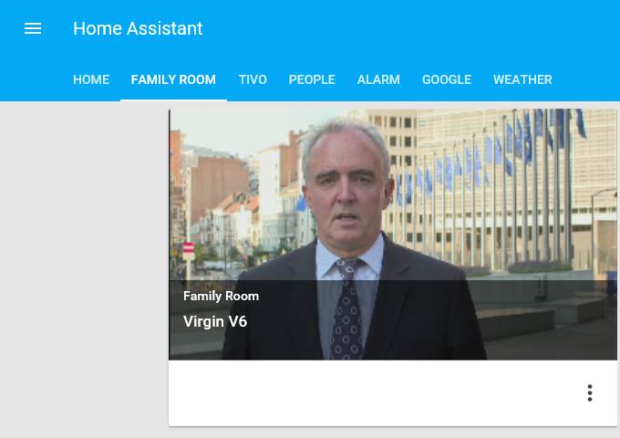
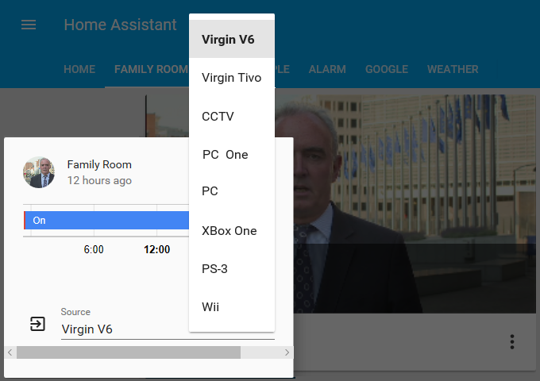

# Home Assistant Just Add Power
A Home Assistant component for the Just Add Power HD over IP 2G/3G systems.  Currently requires a supported Cisco switch configured with JADConfig.




# Usage
+ Drop the file into the custom_components/media_player directory.
+ Edit your configuration file to add the `justaddpower` platform.

# Configuration
There are 3 sections required: switch, receivers and transmitters.

## switch
The switch is polled on a regular basis to determine the current configuration, as well as to change sources.  The _min_refresh_interval_ determines how often.  This can be different from _scan_interval_ but setting a lower value will not override _scan_interval_.  An example usage would be to allow image pull to happen frequently without overloading the switch with refresh requests.

| Parameter | Default | Description | Example |
|:----------|:--------|:------------|:--------|
| host _(req)_ | | IP or hostname of the network switch | myswitch1234 |
| user _(opt)_ | cisco | Username to log onto switch | myuser |
| password _(opt)_ | cisco | Password for switch | mypass~1 |
| rx_subnet _(opt)_ | 10.128.0.0 | Receiver subnet | 10.128.0.0 |
| min_refresh_interval _(opt)_ | 10 | How often to refresh receiver info from switch | 10 |

## transmitters
The transmitters are listed in the order they appear on the switch.

| Parameter | Default | Description | Example |
|:----------|:--------|:------------|:--------|
| name _(req)_ | | Friendly name | Cable Box |
| usb _(opt)_ | false | Whether this transmitter has USB | true |
| url _(opt)_ |  | URL to image for transmitter - takes precence over image_pull | http://mydomain.com/myimg.jpg |

## receivers
The receivers are listed in the order they appear on the switch.  The IP address is automatically determined and isn't normally required.  However the option exists to override if the auto config doesn't work.

| Parameter | Default | Description | Example |
|:----------|:--------|:------------|:--------|
| name _(req)_ | | Friendly name | Master Bedroom |
| usb _(opt)_ | false | Whether this receiver has USB | true |
| ip_address _(opt)_ | | IP address of switch | mypass~1 |
| image_pull _(opt)_ | false | Display the image from the source | true |
| image_pull_refresh _(opt)_ | 10 | How often to refresh the source image | 30 |

# Example
```
  - platform: justaddpower
    switch:
      host: myswitch12345
    transmitters:
      1:
        name: Virgin V6
      2:
        name: Virgin Tivo
      3:
        name: CCTV
      4:
        name: Main PC
        usb: true
      7:
        name: XBox One
        url: http://mydomain.com/uploads/Xbox-One-Console-480x240.jpg
      8:
        name: PS-3
      9:
        name: Wii
    receivers:
      1:
        name: Family Room
        image_pull: true
      2:
        name: Study
        usb: true
        image_pull: true
        image_pull_refresh: 30
      3:
        name: Games Room
        usb: true
        image_pull: true
        image_pull_refresh: 300
      4:
        name: R4
      5:
        name: R5
      6:
        name: R6
```
